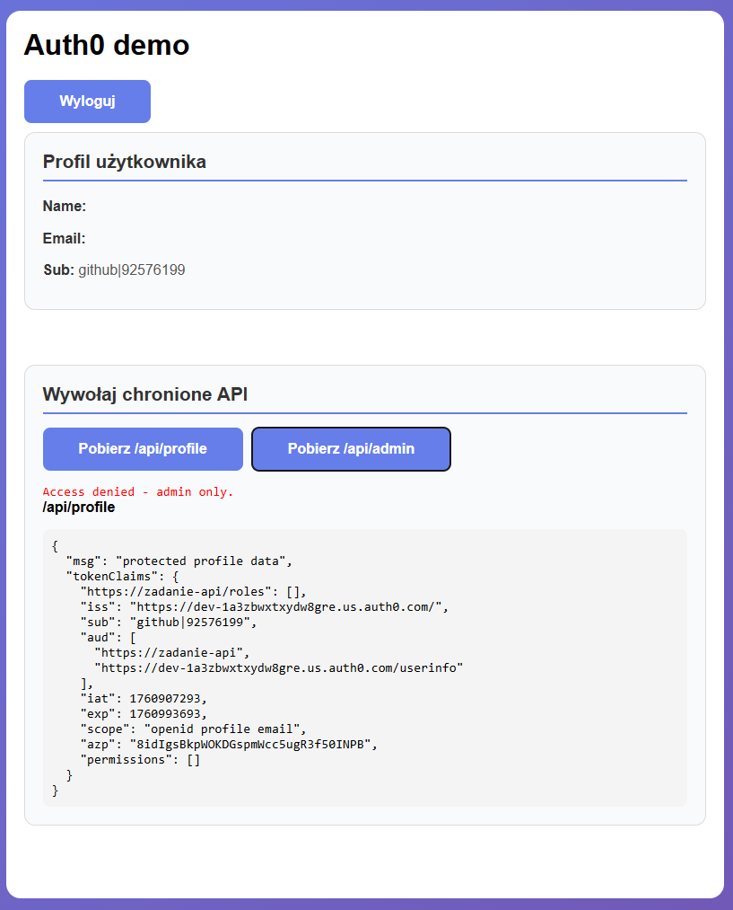
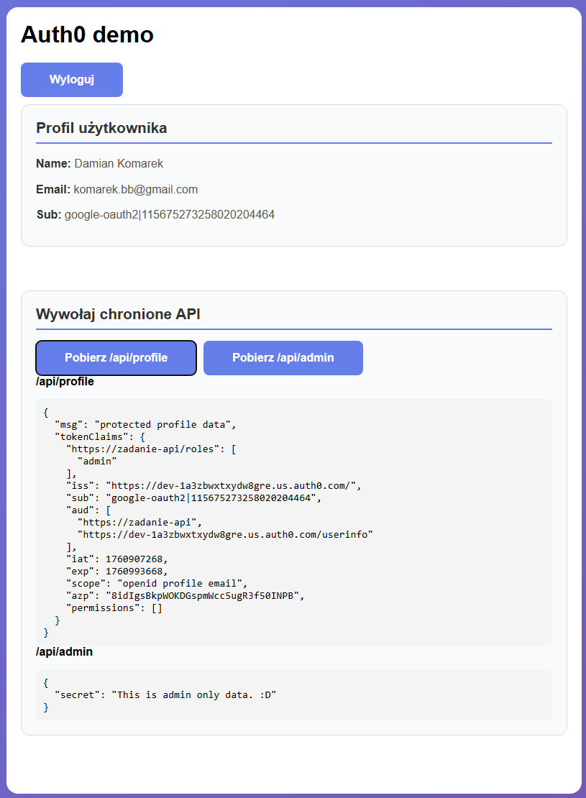

Aplikacja została zbudowana w oparciu o React (SPA) i Node.js (Express) ze względu na prostą integrację z Auth0 i szybkie uruchomienie środowiska lokalnego.

- **Frontend React (SPA)**:

    - pozwala łatwo użyć oficjalnej biblioteki @auth0/auth0-react, która obsługuje logowanie, tokeny i sesje po stronie klienta.

- **Backend Node.js (Express) + `express-oauth2-jwt-bearer`**:

    - pełni funkcję API zabezpieczonego przez JWT, co umożliwia ochronę zasobów oraz weryfikację ról użytkowników.

| Wymaganie | Opis |
|-----------|-------|
| 1. Logowanie użytkownika przez Auth0 | Universal Login przez `@auth0/auth0-react` i tokenów RS256|
| 2. Wylogowanie użytkownika |  `logout()` kończy sesję lokalną i w Auth0 |
| 3. Ochrona zasobów (strona/endpoint tylko dla zalogowanych) | `/api/profile` chronione przez middleware `checkJwt` |
| 4. Wyświetlenie danych użytkownika | `user.name`, `user.email`, `user.sub` |
| 5. Weryfikacja tokena JWT | backend używa `express-oauth2-jwt-bearer` i JWKS do walidacji |

#### Dodatkowe
| Wymaganie | Opis |
|-----------|-------|
| 1. Możliwość rejestracji nowych użytkowników  | Włączona w Auth0 |
| 2. Obsługa ról lub uprawnień | Rola `admin` w Auth0 wraz z akcją i triggerem przed zalogowaniem przekazującym role do tokena |
| 3. Backend z prostym API zabezpieczonym przez Auth0 | `/api/profile` - chroniony tokenem JWT, `/api/public` - otwarty |

---
# Uruchomienie


## ENV

> Utwórz 2 pliki .env i skopiuj i wklej konfigurację

### /auth0-spa/.env
```env
REACT_APP_AUTH0_DOMAIN=XXX
REACT_APP_AUTH0_CLIENT_ID=YYY
REACT_APP_AUTH0_AUDIENCE=https://zadanie-api
REACT_APP_AUTH0_CALLBACK_URL=http://localhost:3000
```

### /auth0-api/.env
```env
PORT=4000
AUTH0_DOMAIN=XXX
AUDIENCE=https://zadanie-api

```
---
<span style="font-size:xx-large;">⚠️</span> `DOMAIN` i `CLIENT_ID` wysłałem w mailu

---
## Start

> W CMD

### Backend
```
cd auth0-api
npm install
node server.js
```
działa na http://localhost:4000

### Frontend

```
cd auth0-spa
npm install
npm start
```
działa na http://localhost:3000


---
# Dodatkowe info

## Konfiguracja Auth0

### Aplikacja
- Typ: **Single Page Application**
- Allowed Callback URLs: `http://localhost:3000`
- Allowed Logout URLs: `http://localhost:3000`
- Allowed Web Origins: `http://localhost:3000`

### API
- Name: `zadanie-api`
- Identifier: `https://zadanie-api`
- Signing Algorithm: `RS256`


### Role
- User Managment -> Roles -> new role name "admin" -> Users -> przypisz rolę
- Library -> Create Action:
```js
exports.onExecutePostLogin = async (event, api) => {
  const namespace = 'https://zadanie-api/'; 
  // pobierz role przypisane użytkownikowi (RBAC → Roles)
  const roles = event.authorization?.roles || [];
  // dodaj je jako custom claim w Access Tokenie
  api.accessToken.setCustomClaim(`${namespace}roles`, roles);
};
```

---

| Bez admina | Z adminem |
|-----------|-------|
 | 
